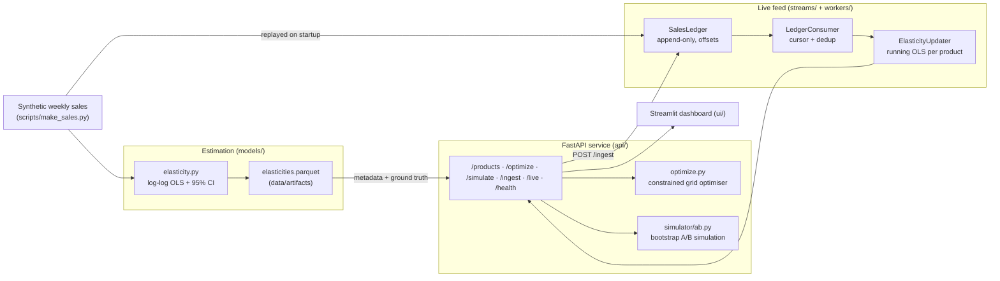

<div align="center">


</div>

# PriceOptic — Econometric Pricing Intelligence

**Estimate how demand responds to price, then find the price that maximises profit within the margins you can actually live with.** PriceOptic fits a per-product price-elasticity model with confidence intervals, feeds it into a constrained profit optimiser, and simulates what a proposed price change would do to revenue — including the odds it backfires. The domain core is built from immutable value objects and total functions, so a pricing computation can never leave a caller holding a half-finished decision or a silently mutated number.

<div align="center">

[](https://www.python.org/)
[](https://fastapi.tiangolo.com/)
[](https://pytest.org/)
[](https://opensource.org/licenses/MIT)

</div>

---

## The problem

"What price should we set?" hides two hard questions. First, *how sensitive is demand to price?* — the price elasticity, which you have to estimate from noisy historical sales where price and season move at the same time. Second, *given that estimate, what price is best?* — and "best" is never unconstrained: you have a minimum margin to protect and a limit on how far you dare move from today's price in one step.

PriceOptic answers both, and adds a third the naive workflow skips: *should we trust the change?* Elasticity estimates come with error bars, and a point recommendation hides that uncertainty. So before a price ships, PriceOptic simulates it — bootstrapping the elasticity and demand noise — to report the distribution of the profit swing and the probability the change actually helps.

## What it does

- **Elasticity estimation** — fits a log-log demand model per product with seasonality controls and reports a 95% confidence interval. Products whose interval is too wide are flagged, not optimised, because a bad estimate makes a bad price.
- **Constrained price optimisation** — searches for the profit-maximising price inside a feasible band set by your minimum margin and maximum allowed price move.
- **A/B revenue simulation** — Monte-Carlo simulates a candidate price against the current one under estimation uncertainty and reports the profit/revenue difference distribution and the probability of a positive outcome.
- **A live sales feed** — new weeks of sales are appended to a ledger and folded into a running per-product OLS (sufficient statistics, not a refit), so the elasticity the API prices on is always the one implied by everything seen so far. `/ingest` reports, per product, whether the new week moved the recommendation, flipped its direction, or pushed the product across the "priceable" gate.

## How it works



The batch step (`models/elasticity.py`) fits every product from scratch, scores estimation quality against the synthetic ground truth and writes the artifact. The service does not price off that artifact's coefficients, though: on first request it replays `sales.parquet` week by week through the ledger into `ElasticityUpdater`, which keeps the same log-log regression as sufficient statistics (X'X, X'y, y'y per product) and solves a 4x4 system on demand. After replay the running estimate matches the batch fit to within its 4-decimal rounding (`tests/test_sales_feed.py::test_running_fit_matches_batch_ols_after_replay`), and from then on `/ingest` moves it one week at a time. The artifact still supplies product metadata and `true_elasticity`.

Two things about the feed are deliberate. The ledger dedups on `(product_id, week)`: a redelivered batch is counted as duplicates and ignored, because folding the same weeks twice into a running OLS makes the standard error drop as if you had twice the evidence (the test folds one product's history twice into a raw `RunningOLS` and checks the se falls by more than a quarter). And a week with zero units is recorded but not fitted - it cannot enter a log-log model, but it should still block a later duplicate. The Streamlit UI is a thin client that talks to the API over HTTP.

### Domain design: immutable value objects + total functions

Pricing decisions carry financial consequences, so the domain layer (`domain/`) is written to make two classes of bug unrepresentable. It has no I/O and no framework imports.

**Immutable value objects (`domain/types.py`)** — every domain concept is a frozen dataclass, constructed once and never mutated, validating itself on construction:

| Value object | Guarantee |
|---|---|
| `Money` | Rejects NaN/Inf at construction; arithmetic returns a new `Money` |
| `Elasticity` | Bundles point estimate + CI; `elasticity_type` and significance are computed properties |
| `PriceRange` | Restores the floor ≤ ceiling invariant in `__post_init__`; `clamp()` is total |
| `PricingContext` | Immutable snapshot of every solver input |
| `PriceRecommendation` | Immutable output — a decision cannot be accidentally overwritten |

**Total solver (`domain/solver.py`)** — `solve_optimal_price_total(ctx) -> PriceRecommendation` handles every input case and always returns a well-formed result. Elastic, inelastic and Giffen (positive-ε) goods are all covered by the same constrained grid search; the `PriceRange` clamp absorbs any optimum that falls outside the feasible band, and the function never raises on an economic edge case.

The production pipeline uses a parallel, config-driven implementation of the same optimisation in `models/optimize.py`, which reads the margin and price-move limits from `configs/config.yaml`.

## Methodology

### Elasticity: log-log OLS with seasonality controls

Demand is modelled as a constant-elasticity power law in price, with an annual Fourier seasonality control:

$$\ln Q_t = \alpha + \varepsilon \ln P_t + \gamma_1 \sin\!\left(\tfrac{2\pi w_t}{52}\right) + \gamma_2 \cos\!\left(\tfrac{2\pi w_t}{52}\right) + u_t$$

The coefficient $\varepsilon$ is the price elasticity of demand. The batch estimator fits it by ordinary least squares (`numpy.linalg.lstsq`); the live estimator accumulates $X^\top X$, $X^\top y$ and $y^\top y$ and solves the normal equations, which gives the same $\hat\varepsilon$ and the same standard error from $\sigma^2 (X^\top X)^{-1}$ with $\sigma^2 = (y^\top y - \hat\beta^\top X^\top y)/(n-4)$. The reported interval is $\hat\varepsilon \pm 1.96\,\mathrm{se}$. Products with fewer than 20 non-zero weeks or fewer than 4 distinct prices are not estimated, and the optimiser refuses any product whose standard error exceeds 0.5.

### The se gate, measured over time

Because the feed re-solves every week, you can ask what the se ≤ 0.5 gate actually buys. `scripts/replay_feed.py` replays the bundled 40-product, 104-week history one week at a time, re-optimises every product every week, and scores each gate threshold on when products become priceable, how often the recommendation reverses direction week to week, and how often it points the wrong way relative to the optimum under the product's *true* elasticity:

```
uv run python scripts/replay_feed.py
```

```
gate  products_priced  median_first_week  priceable_product_weeks  reversals  wrong_way_weeks  wrong_way_pct  weeks_forgone_pct
none               40               19.0                     3283         24              211            6.4               21.1
 1.0               40               19.0                     3220         17              196            6.1               22.6
 0.5               40               29.5                     2956         12              150            5.1               28.9
 0.3               39               44.0                     2209          4               93              4.2               46.9
 0.2               33               77.0                      865          1               20              2.3               79.2
```

(Bundled dataset, `seed: 42` in `configs/config.yaml`; regenerate with `scripts/make_sales.py` and the numbers move.) The gate at 0.5 halves week-to-week reversals (24 → 12) for about 8 points more product-weeks left unpriced, but it barely changes how often the direction is wrong (6.4% → 5.1%). What the gate mostly buys is *stability*, not correctness - the direction is right most of the time even ungated, and a product that has just crossed the gate is the one most likely to flip back. Tightening to 0.2 gets reversals down to one but leaves 7 of 40 products unpriced after two years. The replay also shows priceability is not monotone: the count of priceable products at se ≤ 0.5 drops at weeks 36 and 64 (`--weekly`), which is why `/ingest` reports `lost_priceability` as its own flag.

### Constrained profit optimisation

For a candidate price $P$, reference price $P_0$ and unit cost $c$, profit under constant elasticity is:

$$\Pi(P) = (P - c) \cdot \left(\frac{P}{P_0}\right)^{\hat\varepsilon}$$

maximised over the feasible band

$$P \in \left[\max\!\left(c(1+m_{\min}),\; P_0(1-\delta)\right),\; P_0(1+\delta)\right]$$

where $m_{\min}$ is the minimum margin and $\delta$ the maximum price move. The optimiser evaluates 500 grid points across the band, so it returns a valid answer for any demand shape (including inelastic goods that push straight to the ceiling) and reports which constraint, if any, binds.

### A/B revenue simulation

To size the risk of a price change, `simulator/ab.py` draws the elasticity from $\mathcal{N}(\hat\varepsilon, \mathrm{se})$, adds lognormal weekly demand noise to both the current and candidate arms, and reports the mean, 5th and 95th percentiles of the profit difference plus the probability it is positive.

## Getting started

Requires [uv](https://github.com/astral-sh/uv) and Python 3.12.

```bash
make install                                 # uv sync --group dev

uv run python scripts/make_sales.py          # generate synthetic sales -> data/processed
uv run python -m priceoptic.models.elasticity  # estimate elasticities -> data/artifacts

make api                                     # FastAPI on http://localhost:8120
make ui                                      # Streamlit dashboard on http://localhost:8621
```

Run the estimation step before starting the API — the endpoints read the `elasticities.parquet` artifact and return `503` until it exists.

Or with Docker:

```bash
make docker-up                               # api on :8120, ui on :8621
make docker-down
```

## API

| Method | Route | Purpose |
|---|---|---|
| `GET` | `/health` | Liveness check |
| `GET` | `/products` | Running estimate vs true elasticity per product, with 95% CIs, weeks folded and the priceable flag |
| `GET` | `/optimize/{product_id}` | Constrained profit-maximising price on the current running estimate |
| `GET` | `/live/{product_id}` | The running estimate and the recommendation it implies (or `null` when not priceable) |
| `POST` | `/ingest` | Append weekly sales observations and get a before/after recommendation delta per product |
| `POST` | `/simulate` | A/B simulate a candidate price (`{"product_id": 1, "candidate_price": 27.5}`) |

Example — recommend a price for product 1:

```bash
curl http://localhost:8120/optimize/1
```

```jsonc
// Illustrative shape only — values depend on the synthetic dataset and seed.
{
  "product_id": 1,
  "elasticity": -1.83,
  "n_obs": 104,
  "current_price": 29.99,
  "recommended_price": 27.41,
  "change_pct": -0.0861,
  "expected_profit_lift_pct": 0.0423,
  "binding_constraint": "none"
}
```

`/optimize` returns `422` when a product's elasticity is not estimable or its confidence interval is too wide to price on.

Feed a new week and see what it did:

```bash
curl -X POST http://localhost:8120/ingest -H 'content-type: application/json' -d '{"observations": [{"product_id": 1, "week": 104, "price": 60.0, "units": 900}]}'
```

The response carries `folded`, `duplicates` and `zero_sales` counts, a `rejected` list with the reason for every row that did not parse, and one `deltas` entry per touched product with the estimate and recommendation before and after plus four flags: `became_priceable`, `lost_priceability`, `direction_flipped`, `binding_changed`. Posting the same week again is a no-op (`duplicates: 1`, no delta). A batch naming an unknown `product_id` is refused whole with `404` before anything lands.

## Evaluation

Because the sales data is synthetic, every product carries a **known true elasticity**, so estimation quality can be measured directly. `models/elasticity.py` reports the mean absolute error between the estimated and true elasticities and the 95%-CI coverage (how often the true value falls inside the estimated interval), and logs both to MLflow. To reproduce:

```bash
uv run python scripts/make_sales.py
uv run python -m priceoptic.models.elasticity    # prints MAE and CI coverage
make mlflow                                       # optional: MLflow UI on http://localhost:5013
```

No fixed numbers are quoted here — they depend on the generated dataset and seed. Run the command to produce them for your configuration.

## Testing

```bash
make test                                    # uv run pytest --cov
```

- `test_domain_value_objects.py` — value-object immutability/validation and total-solver coverage
- `test_elasticity.py` — OLS estimation on synthetic data with known parameters
- `test_sales_feed.py` — observation contract, running fit equals the batch fit after replay, cursor resume, duplicate re-delivery cannot shrink the se (and the naive fit that would), the 20-week gate over time
- `test_api.py`, `test_ingest_api.py` — HTTP endpoint contracts; `/ingest` moving a recommendation, replay as a no-op, malformed rows reported without dropping good ones

## Limitations

- Estimation accuracy is capped by price variation in the history — products that rarely reprice have wide intervals and are refused rather than priced.
- The demand model assumes constant elasticity and a single annual seasonality term; real demand has cross-price effects, competitor moves and trends this ignores.
- The optimiser assumes the estimated elasticity holds at the recommended price; large moves extrapolate beyond the observed price range.
- All bundled data is synthetic; thresholds and priors would need recalibration on real sales.
- The ledger is in-process memory. Weeks posted to `/ingest` survive until the API restarts, at which point the feed is re-seeded from `sales.parquet`; a durable broker would replace `SalesLedger` behind the same `read_from(offset)` interface.
- The se gate is a stability device, not a correctness guarantee - see the replay table above.

## Project structure

```
src/priceoptic/
├── domain/         # Immutable value objects + total solver (no I/O, no frameworks)
│   ├── types.py    #   Money, Elasticity, PriceRange, PricingContext, PriceRecommendation
│   └── solver.py   #   solve_optimal_price_total() — pure, total
├── models/         # elasticity.py (log-log OLS + CI), optimize.py (constrained grid optimiser)
├── simulator/      # ab.py — bootstrap A/B revenue/profit simulation
├── streams/        # schemas.py (observation contract), producer.py (SalesLedger), consumer.py (cursor + dedup)
├── workers/        # processor.py — RunningOLS / ElasticityUpdater / review_delta
├── api/            # main.py (app factory) + routes.py (endpoints)
├── ui/             # app.py — Streamlit dashboard
└── settings.py     # pydantic-settings + configs/config.yaml loader
scripts/make_sales.py   # synthetic sales generator with known true elasticities
scripts/replay_feed.py  # week-by-week replay scoring the se gate (reversals, wrong-way weeks)
```

## License

MIT

---

<div align="center">

**Jackson Marcus** · Senior AI & Machine Learning Engineer

[](https://github.com/jackson-marcus)
[](mailto:wajahatanees41@gmail.com)

</div>
